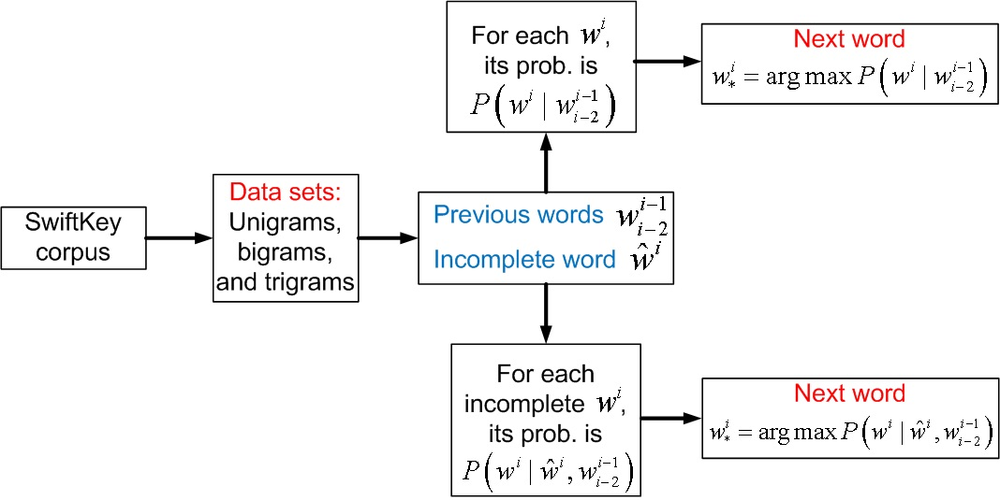
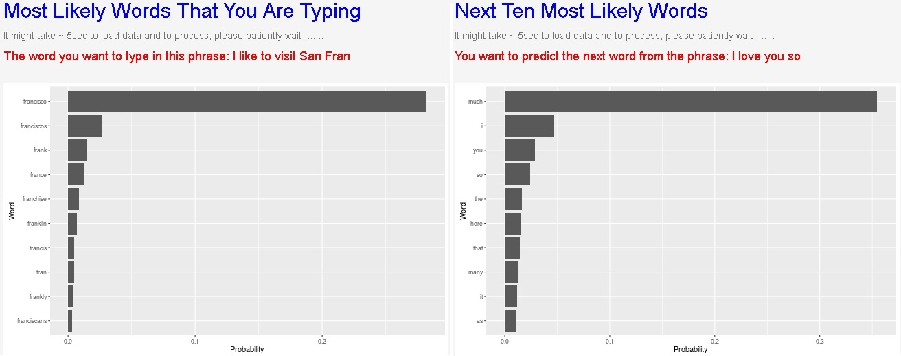

## Overview of a Predictive Word App

<ol>
<li> Two objectives: </li>
    <ul>
        <li> Predict which word the user is typing now.  </li>
        <li> Predict which word the user wants to type next.  </li>
    </ul>
<li> Our approach: n-grams and weighted back-off model 
    <ul>
        <li> Given a corpus (from SwiftKey), we extract three datasets from 30k randomly selected tweets, 30k blog posts, and 30k news (anymore and shinyapps.io will crash):  </li>
                <ul>
                    <li> Unigrams: 95158 objects with their probabilities
                    <li> Bigrams: 1001663 objects with their probabilities
                    <li> Trigrams: 2047245 objects with their probabilities
                </ul>
        <li> Weighted back off model for next word prediction (problem 2): <big> $w^i$ </big> is the word we want. Then its probability is: $P(w^i|w^{i-1}_{i-2}) = \alpha_1 \frac{P(w^{i}_{i-2})}{P(w^{i-1}_{i-2})} + \alpha_2 \frac{P(w^{i}_{i-1})}{P(w^{i-1})} + \alpha_3 P(w^i)$   </li>
        <li> Weighted back off model for current word prediction (problem 1): similarly defined. </li>
    </ul>

--- .class #id 

## The proposed scheme flowchart

  

--- .class #id

## Type in the phrase and get the prediction!

<ol>
<li> The app link is here: https://ngduyhieu.shinyapps.io/CapStone_ShinyApp </li>
<li> Example: type in "I like to visit San Fran" </li>
<li> Example: type in "I love you so" </li>

  

--- .class #id 

 Thank you 
   
 Please support my world-changing :) app 

